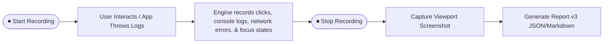

# 🕵️ Bug Black Box

> [!NOTE]  
> **Bug Black Box** is a premium flight recorder for web applications, packaged as a lightweight Chrome Extension. It captures user interaction flows, console logs, runtime errors, failed network requests, and active viewport screenshots to automatically generate structured bug reports.



---

## ✨ Features

- **Start/Stop UI**: Clean status indicator and real-time timer in the popup interface.
- **Console Capture**: Records `console.log`, `console.warn`, and `console.error` with high-precision timestamping.
- **JS Exception Capture**: Intercepts unhandled runtime exceptions (`window.onerror` and rejected promises).
- **Interaction Click-Trail**: Chronological tracking of target selectors without leaking user inputs.
- **Failed Request Logging**: Monitors status `>= 400` network requests and connection aborts.
- **AI Explain Integration**: Translates complex runtime stack traces into plain English explanations via AI.
- **Dual Export**: Instantly exports reports as clean, standalone Markdown `.md` or raw JSON `.json`.

---

## 🚀 Getting Started

### 📦 Installation
1. Open Google Chrome and navigate to `chrome://extensions`.
2. Toggle **Developer mode** on at the top-right corner.
3. Click **Load unpacked** on the top-left.
4. Select the directory:
   ```text
   bug-black-box
   ```
5. Pin the **Bug Black Box** icon to your toolbar for quick access.

> [!IMPORTANT]  
> **File Access**: If you want to record local `.html` files opened using `file://` protocols, ensure you toggle **Allow access to file URLs** on for Bug Black Box in `chrome://extensions`.

---

## ⚡ Multi-Tab Flow & Replay System

Bug Black Box allows developers to trace complex issues that span across multiple tabs during a single session:

- **Focus Timelines**: Tracks when tabs are entered or left, storing them under `activeRanges`.
- **Event Correlation**: Group clicks, console logs, and related network activities automatically.
- **Spam Flagging**: Flags UI elements receiving heavy repetitive user clicks (`isSpam: true`).
- **Global Synchronization**: Maps all events chronologically in a `globalTimeline` using relative timestamp markers, allowing seamless cross-tab visual replays.

---

## 🔒 Security & Privacy First

- **Sensitive Field Masking**: Headers, URLs, and bodies containing keywords like `password`, `token`, `secret`, `authorization`, `cookie`, `apiKey`, or `session` are automatically masked to `[redacted]`.
- **Input Text Shielding**: Click events do not record input contents, textareas, or content-editable containers. They only store the target selector path (e.g., `input[type="password"]`).
- **Local Storage Cache**: Data is cached in `chrome.storage.local`. No external server uploads or analytical calls are performed.
- **Local Storage Cache**: Data is cached in `chrome.storage.local`. No external server uploads or analytical calls are performed.

---

## Task 06 Test Page and Privacy Audit

Use this flow before release QA for Capture Engine 2.0.

### Run the local test pages

From the repository root:

```powershell
python -m http.server 8080
```

Open:

```text
http://127.0.0.1:8080/test-pages/phase-1-replay.html
```

The legacy smoke-test page is still available at:

```text
http://127.0.0.1:8080/test-page.html
```

### What the Phase 1 page covers

- Login form with email, password, token, and textarea fields.
- Fake sensitive values: `fake-password-123`, `fake-token-123`, `fake-api-key-123`, textarea secret, and contenteditable secret.
- Multi-step click flow.
- `console.log`, `console.warn`, and `console.error`.
- Thrown JavaScript error.
- Unhandled promise rejection.
- Failing network request with sensitive query params.
- Contenteditable privacy field.
- High-frequency DOM changes for replay/storage testing.
- A link that opens a second tab for All tabs recording.

### Manual audit flow

1. Load the unpacked extension from `bug-black-box`.
2. Open the Phase 1 test page through localhost.
3. Run a Current tab recording and trigger every button at least once.
4. Stop recording, open replay, then verify play, pause, and seek.
5. Export Markdown and JSON.
6. Run an All tabs recording.
7. Click the second-tab link, interact with both tabs, stop, and replay.
8. Start DOM churn for a longer session and confirm storage truncation is graceful if limits are reached.
9. Close one recorded tab before stopping and confirm report creation still succeeds.
10. Try starting on `chrome://extensions` and confirm the popup shows a clear restricted-page error.

### Privacy checklist

Complete the tracked checklist before Task 05 release QA:

```text
.task/phase1/phase-1-privacy-checklist.md
```

The checklist must be verified against exported JSON and Markdown files, not only the popup UI. Search the exported files for every fake sensitive value and confirm there are no matches.

### Expected privacy behavior

- Password, token, email, textarea, and contenteditable values are not stored raw.
- Sensitive URL query params are redacted to `[redacted]`.
- Debug events store selectors and safe labels, not form values.
- Replay has `maskAllInputs` enabled.
- Replay masks contenteditable text through `maskTextSelector`.
- Phase 1 data stays local in `chrome.storage.local` and local exports unless the user explicitly uses AI Explain.
