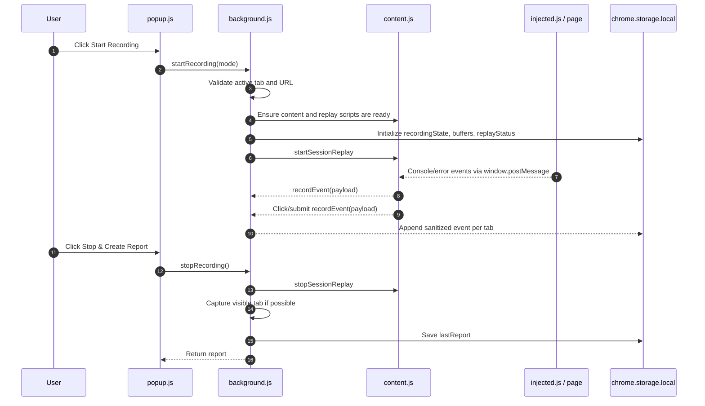

# Technical Architecture - Bug Black Box

## 1. Architecture Overview

Bug Black Box is a browser-only Chrome Manifest V3 extension. It has no backend service. Runtime coordination happens through Chrome extension messaging, `chrome.storage.local`, content scripts, a service worker, and popup/options pages.

The extension is split into five execution areas:

| Area | Files | Responsibility |
| --- | --- | --- |
| Extension manifest | `bug-black-box/manifest.json` | Declares permissions, content scripts, popup, options page, service worker, icons, and host access. |
| Main-world capture | `bug-black-box/injected.js` | Hooks page console APIs and global error handlers from the page context. |
| Isolated content bridge | `bug-black-box/content.js` | Captures DOM actions and forwards page messages to the service worker. |
| Session replay capture | `bug-black-box/session-recorder.js`, `bug-black-box/vendor/rrweb.min.js` | Records root-tab replay events with input masking. |
| Background service worker | `bug-black-box/background.js` | Owns recording state, storage writes, network failure capture, screenshot capture, report compilation, and AI Explain calls. |
| User interfaces | `bug-black-box/popup/*`, `bug-black-box/options/*`, `bug-black-box/replay/*` | Provides recording controls, report preview/export, settings, and replay playback. |

## 2. Runtime Contexts

Chrome extensions isolate content scripts from the web page's JavaScript context. Bug Black Box uses separate scripts so each task runs in the right context.

| Context | Script | Why It Exists |
| --- | --- | --- |
| Page main world | `injected.js` | Console methods and global errors must be observed where the page code runs. |
| Extension content script | `content.js` | DOM events and `window.postMessage` forwarding are safer from the isolated extension context. |
| Extension content script with vendor library | `session-recorder.js` | `rrweb.record()` captures replay events with masked inputs. |
| Service worker | `background.js` | Centralizes state, storage, network events, screenshot capture, and report generation. |
| Popup/options/replay pages | HTML/CSS/JS under `popup/`, `options/`, `replay/` | User-facing controls and report viewing. |

## 3. Main Recording Flow



## 4. Manifest Configuration

The extension uses Manifest V3 and requires Chrome 111 or newer.

Key manifest entries:

| Entry | Purpose |
| --- | --- |
| `minimum_chrome_version: "111"` | Required because `injected.js` runs in `"world": "MAIN"`. |
| `permissions.storage` | Stores recording state, event buffers, replay events, reports, and API key config. |
| `permissions.activeTab`, `permissions.tabs` | Reads active tab metadata and captures screenshots. |
| `permissions.scripting` | Injects scripts when a tab was not already prepared. |
| `permissions.webRequest` | Records failed network requests. |
| `permissions.unlimitedStorage` | Reduces local storage pressure for reports and replay events. |
| `host_permissions: ["<all_urls>"]` | Allows recording on normal web pages when Chrome permits content scripts. |
| `host_permissions: ["https://generativelanguage.googleapis.com/*"]` | Allows Gemini AI Explain requests. |

## 5. Event Capture Responsibilities

| Event Type | Captured By | Storage Type | Notes |
| --- | --- | --- | --- |
| `console` | `injected.js` | `eventBuffersByTab` | Supports `log`, `warn`, and `error`. |
| `jsError` | `injected.js` | `eventBuffersByTab` | Captures uncaught errors and unhandled promise rejections. |
| `click` | `content.js` | `eventBuffersByTab` | Stores selector and safe display text. |
| `submit` | `content.js` | `eventBuffersByTab` | Stores form selector and `"Form submitted"`. |
| `networkError` | `background.js` | `eventBuffersByTab` | Records failed status or browser network error. |
| replay event | `session-recorder.js` | `replayEvents` | Stored separately from report events. |

## 6. Recording Modes

| Mode | Code Value | Behavior |
| --- | --- | --- |
| Current tab | `activeTab` | Only the root tab that started the recording contributes action/error/network events. |
| All tabs | `allTabs` | Recordable tabs can contribute events to the same session and are grouped under `tabs[]`. |

The root tab always owns screenshot capture and replay capture. In all-tabs mode, event buffers can include multiple tabs, but replay storage is still limited to the root tab.

## 7. Storage and Write Strategy

The service worker serializes writes through a `writeQueue` promise to reduce race conditions when many events arrive quickly. Event buffers are capped:

| Buffer | Limit | Behavior |
| --- | --- | --- |
| Events per tab | 500 | New events are appended and old events are dropped from the front. |
| Replay events | 5000 | New replay batches are appended and old replay events are dropped from the front. |
| Replay flush batch | 25 events or 2 seconds | `session-recorder.js` periodically sends replay events to the service worker. |

If replay storage fails, the service worker progressively reduces replay events until storage succeeds or the minimum fallback threshold is reached.

## 8. Network and AI Integration

Failed request capture is local to Chrome `webRequest` events. The extension stores method, sanitized URL, status code, browser error text, and timestamp. It does not store request bodies or response bodies.

AI Explain is the only outbound integration in the current extension:

| Item | Value |
| --- | --- |
| Provider | Google Gemini |
| Endpoint host | `generativelanguage.googleapis.com` |
| Model constant | `gemini-3.1-flash-lite` |
| API key storage | `chrome.storage.local -> apiConfig.apiKey` |
| Prompt source | Current report events, shortened for practical size limits |

The user provides the API key in the options page. The key is not hardcoded in the repo.

## 9. Directory Map

```text
bug-black-box/
  manifest.json
  background.js
  content.js
  injected.js
  session-recorder.js
  vendor/
    rrweb.min.js
    rrweb-player.min.js
    rrweb-player.css
  popup/
    popup.html
    popup.css
    popup.js
  options/
    options.html
    options.css
    options.js
  replay/
    replay.html
    replay.css
    replay.js
  icons/
    icon16.png
    icon48.png
    icon128.png
  scripts/
    generate_icons.py
```

## 10. Architectural Constraints

- Chrome does not allow content scripts on internal pages such as `chrome://extensions`.
- `file://` pages require the user to enable **Allow access to file URLs** for the extension.
- Screenshot capture depends on the root tab being active in its window.
- Service workers can be restarted by Chrome, so persistent state must live in `chrome.storage.local`.
- The project intentionally avoids a backend in the current implementation.
