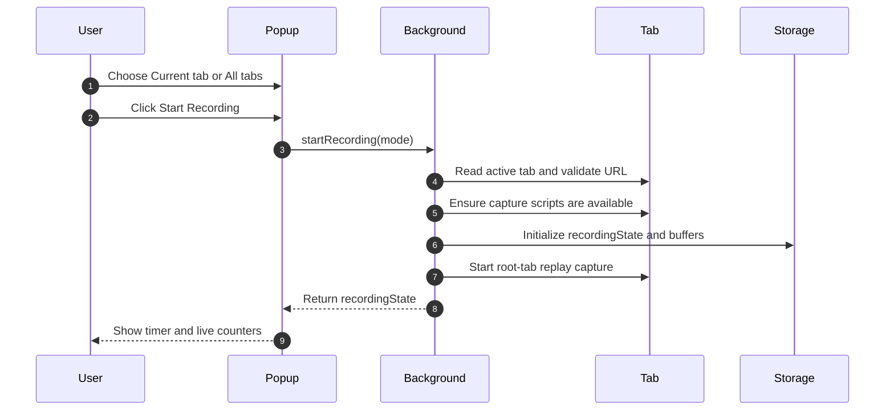
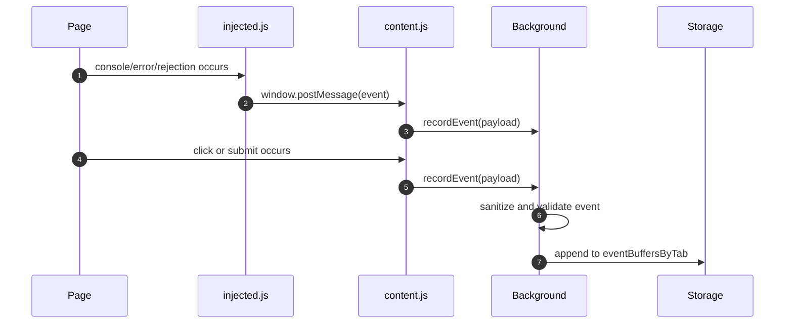
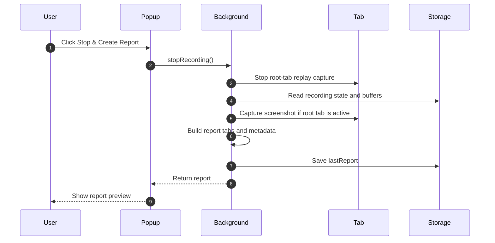
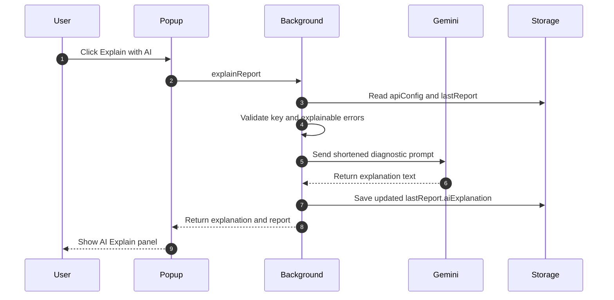

# User Flows - Bug Black Box

## 1. Start Recording

### Expected Result

- The popup changes to the recording state.
- `recordingState.isRecording` is `true`.
- Event buffers are empty at the beginning of the session.
- Replay status is initialized.

### Failure Paths

| Condition | Result |
| --- | --- |
| No active tab | Popup shows `NO_ACTIVE_TAB` message. |
| `chrome://` or other restricted page | Popup shows `RESTRICTED_PAGE` message. |
| `file://` page without permission | Popup shows `FILE_ACCESS_REQUIRED` message. |
| Script injection fails | Popup shows `INJECTION_FAILED` message. |

## 2. Capture User and Runtime Events

### Expected Result

- Console and JavaScript error events are stored with timestamps.
- Click and submit events are stored without raw form values.
- Failed network requests are stored by the background service worker.
- In all-tabs mode, events can be grouped under different tab entries.

## 3. Stop Recording and Build Report

### Expected Result

- `recordingState.isRecording` becomes `false`.
- `lastReport` is written to local storage.
- The popup displays report summary, steps, errors, network failures, screenshot state, and replay availability.

### Known Limitation

Screenshot capture is skipped when the root tab is not active in its window. The report remains usable and stores the screenshot error reason.

## 4. Download Markdown Report

1. User reviews the report preview.
2. User clicks **Download Report (.md)**.
3. `popup.js` builds a Markdown document from `lastReport`.
4. Browser downloads a file named with the `bug-report-YYYYMMDD-HHMMSS.md` pattern.

The Markdown report contains both human-readable sections and raw `lastReport` JSON for technical review.

## 5. Open Session Replay

1. User stops a recording that captured replay events.
2. Popup displays **View Session Replay**.
3. User clicks the button.
4. Extension opens `replay/replay.html`.
5. Replay page loads `replayEvents` from local storage.
6. `rrweb-player` renders the replay with custom controls.

If replay data is missing or incomplete, the replay page shows an empty state instead of failing silently.

## 6. Use AI Explain

### Preconditions

- A Gemini API key is saved in settings.
- The report contains at least one `jsError` or `console.error`.

### Failure Paths

| Condition | Result |
| --- | --- |
| Missing key | Popup asks the user to open settings. |
| No explainable errors | Popup reports that there are no JavaScript or console errors to explain. |
| Invalid key | Popup shows invalid key message. |
| Rate limit | Popup shows rate-limit message. |
| Network failure | Popup shows network error message. |

## 7. Reset and Record Again

1. User clicks **Clear & Record Again**.
2. Popup sends `resetReport`.
3. Background clears recording state, event buffers, replay events, replay status, and `lastReport`.
4. Popup returns to idle state.

The Gemini API key is not cleared by report reset. It is managed separately from the options page.
