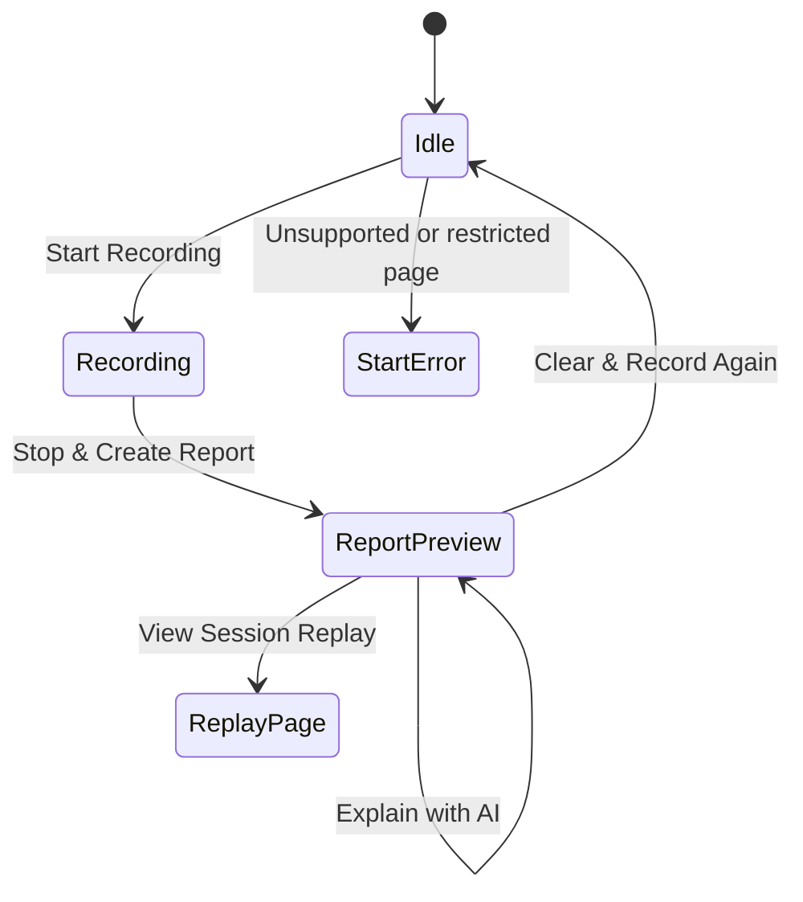

# User Interface Specification - Bug Black Box

## 1. UI Surfaces

Bug Black Box has three user-facing surfaces:

| Surface | Files | Purpose |
| --- | --- | --- |
| Popup | `bug-black-box/popup/popup.html`, `popup.css`, `popup.js` | Start/stop recording, show status, preview report, download report, open replay, trigger AI Explain. |
| Options page | `bug-black-box/options/options.html`, `options.css`, `options.js` | Save or clear the Gemini API key used by AI Explain. |
| Replay page | `bug-black-box/replay/replay.html`, `replay.css`, `replay.js` | Play the latest root-tab session replay using `rrweb-player`. |

The UI is intentionally compact because the main control surface is a Chrome extension popup.

## 2. Popup States

## 3. Idle State

The idle state is shown when no recording is active and no `lastReport` is available.

Main elements:

- title: **Bug Black Box**
- settings icon button
- short product description
- safety notice for `chrome://` pages and file URL usage
- recording mode picker:
  - **Current tab**
  - **All tabs**
- primary action: **Start Recording**
- privacy hint explaining that input values, passwords, cookies, and request bodies are not recorded

Start failure messages are rendered in the same state when the background service worker returns an error.

## 4. Recording State

The recording state appears after recording starts.

Main elements:

- recording status banner with elapsed timer
- selected mode label
- captured tab count
- live counts for:
  - logs
  - errors
  - actions
  - network failures
- captured tab list when mode is **All tabs**
- primary action: **Stop & Create Report**
- hint reminding the user to keep the target tab open until screenshot capture

The popup refreshes counters once per second by calling `getStatus`.

## 5. Report Preview State

The report preview appears after `stopRecording` returns a compiled report.

Main elements:

- report status banner:
  - error styling when JavaScript or console errors are present
  - success styling when no JavaScript errors are detected
- root URL, mode, tab count, duration, and event counts
- screenshot preview or screenshot failure notice
- captured tabs list when more than one tab exists
- ordered reproduction steps
- detected JavaScript errors
- failed network requests
- AI Explain panel when explainable errors exist
- buttons:
  - **View Session Replay** when replay data exists
  - **Download Report (.md)**
  - **Clear & Record Again**

Long error previews are shortened in the popup so the UI remains readable. The downloaded Markdown report keeps the full captured report content.

## 6. Options Page

The options page has one focused purpose: manage the Gemini API key used by AI Explain.

Main elements:

- title: **Bug Black Box Settings**
- explanation that the key is saved locally
- password input for the Gemini API key
- **Save Key** button
- **Clear Key** button
- status message

The key is stored under `chrome.storage.local -> apiConfig.apiKey`.

## 7. Replay Page

The replay page opens in a normal browser tab through `chrome.runtime.getURL("replay/replay.html")`.

Main elements:

- replay metadata
- empty state when replay events are missing or incomplete
- event count
- duration
- `rrweb-player` viewport
- custom controls:
  - play/pause
  - restart
  - seek range
  - speed selector

The replay viewer sorts replay events by timestamp and requires at least two timestamped events to play.

## 8. Error States

| Error | Trigger | User Message Intent |
| --- | --- | --- |
| `NO_ACTIVE_TAB` | Chrome cannot find an active tab. | Ask the user to open a normal page and retry. |
| `RESTRICTED_PAGE` | Current tab uses a restricted scheme such as `chrome://`. | Explain that Chrome blocks recording on internal pages. |
| `FILE_ACCESS_REQUIRED` | `file://` page cannot receive injected scripts. | Ask the user to enable file URL access for the extension. |
| `INJECTION_FAILED` | Content or replay script injection failed. | Ask the user to reload the tab or try localhost. |
| `UNSUPPORTED_PAGE` | URL is missing or unsupported. | Ask the user to use a normal website, localhost, or demo page. |
| `MISSING_API_KEY` | AI Explain is requested without a key. | Direct the user to settings. |
| `INVALID_API_KEY`, `RATE_LIMIT`, `NETWORK_ERROR` | Gemini request fails. | Explain the likely provider/API condition. |
| `NO_ERRORS` | AI Explain is requested without JavaScript or console errors. | Explain that there is no error to summarize. |

## 9. UI Constraints

- The popup must stay useful at small extension-popup dimensions.
- Recording and report states should avoid dense walls of text.
- Long technical fields should be previewed, not fully expanded, in the popup.
- The exported report is the detailed artifact; the popup is a review and action surface.
- User-facing text should preserve privacy expectations and make restricted-page limitations clear.
